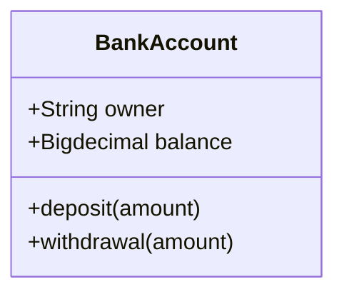

# Object Oriented Programming

* An object is instantiation of a class.
* In this class we use UML to design the class diagram.
  * You can use drawio (AKA diagrams.net), MermaidUML or another tool.

## MermaidUML class example:

